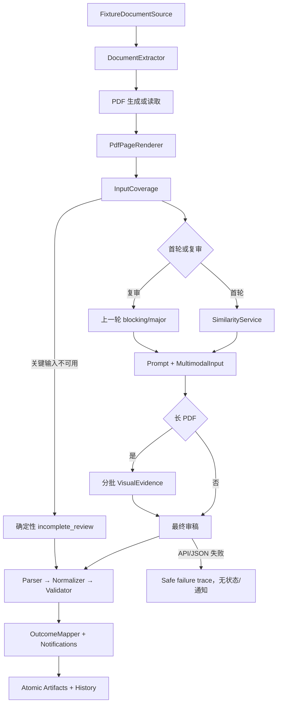

# v2 架构说明

## 边界

系统只有一个核心 `ReviewAgent` 工作流。LangGraph 负责节点顺序、条件边和 checkpoint；规则、PDF、Prompt、模型、校验、通知和存储都是可以脱离 Graph 单测的普通 Python 组件。Fixture 是本阶段唯一文档来源，本地目录是唯一结果落点。

## 数据契约

`ReviewGraphState` 是 Pydantic 状态模型，checkpoint 内仅保存 JSON 可序列化值。公开 DTO 包括 SourceDocument、InputCoverage、VisualManifest、VisualEvidenceAssessment、SimilarityAssessment、ReReviewAssessment、ReviewIssue、ReviewResult 和 ModelCallRecord。

模型原始输出必须匹配 `ModelReviewPayload` 的严格 JSON Schema。模型不负责生成通知和本地状态；最终结果必须依次经过 JSON Parser、类别/等级/计数归一化、覆盖和结论一致性校验，然后才能映射状态。

## 可恢复性与副作用

每个运行目录持有独立 `checkpoint.sqlite` 和 thread ID。节点边界形成 checkpoint；恢复时定位失败节点之前的最近快照并以相同 thread ID 继续。模型调用与落盘分属不同节点，因此落盘中断不会重新调用已完成模型。

所有正式 JSON 产物先写同目录临时文件、刷新并 `os.replace`。普通产物只允许首次写入或内容完全相同的幂等写入；持续更新的 trace 使用原子替换。历史文件保留 records 数组，损坏的历史会被隔离为带时间戳的 `.corrupt-*` 文件。

## 安全

- 真实模型必须由 `--real-model` 或程序级允许开关显式授权，并且必须提供 Key。
- SDK 自动重试关闭；适配器只对超时、429、连接错误和 5xx 做有上限的退避重试。
- Key 使用 `SecretStr`，安全配置快照只记录 Key 是否存在。
- Prompt、日志、trace 和请求摘要不保存 Base64、Authorization、完整请求头或 reasoning content。
- 认证错误、模型空响应、非 JSON 和 Schema 错误不会生成业务状态或通知。

