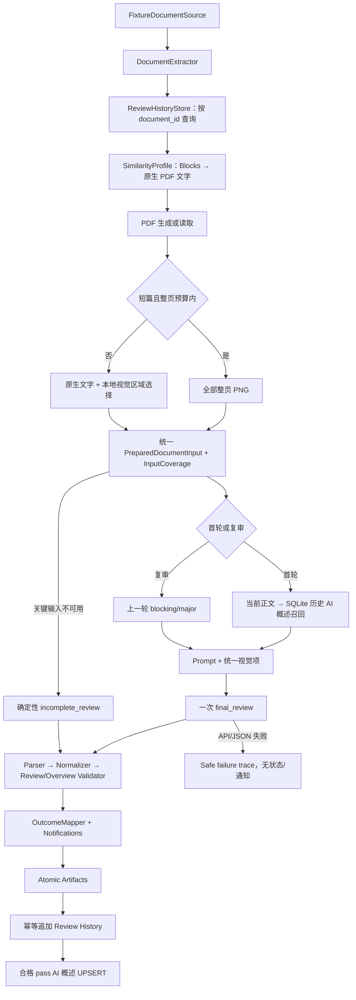

# v2 架构说明

## 边界

系统只有一个核心 `ReviewAgent` 工作流。LangGraph 负责节点顺序、条件边和 checkpoint；规则、PDF、Prompt、模型、校验、通知和存储都是可以脱离 Graph 单测的普通 Python 组件。Fixture 是本阶段唯一文档来源，本地目录是唯一结果落点。Fixture adapter 在边界保留 v1 的 source 字段、原始飞书 Blocks 包装、附件包装和 mock behavior 文件，再统一转换为 v2 内部 DTO；业务组件不依赖测试文件的传输形态。

## 数据契约

`ReviewGraphState` 是 Pydantic 状态模型，checkpoint 内仅保存 JSON 可序列化值。历史查询使用严格的 `ReviewHistoryRecord` 与 `ReviewHistoryLookupAudit`；文字召回使用查询画像 `SimilarityProfile`、模型输出 `ArticleOverview`、五项 `SimilarityScoreDetails` 和 `SimilarityRetrievalAudit`。Fixture Loader 继续兼容 `previous_issues` 和 `similarity_candidates.json`，但 Graph 不使用这些 Fixture 数据决定复审或候选，正式历史与候选都来自本地状态。

## PDF 审稿输入

`PdfDocumentInputPreparer` 统一生成 `PreparedDocumentInput`。短篇在页数、整页图片数和总字节均未超限时保留全部 `full_page`；长篇直接扫描 PDF 对象，不先渲染所有整页。可靠 Blocks 保持为正文；无可靠 Blocks 时按页提取原生文字并保留 `[PDF第N页]` 边界。

长篇局部视觉通过 image block bbox、`find_tables()` 和 `get_drawings()` 提取。简单表格转 Markdown，复杂表格、图片、矢量图和扫描页生成带类型与 bbox 的视觉项。候选按重要性稳定排序，先做 SHA-256、再做 dHash 去重，最后同时应用数量、总字节和整页兜底预算。必要视觉内容未选中时覆盖降为 partial，结果不能被归一为 pass/reject。默认只有一次 `final_review`；旧 `VisualEvidenceBatch` 仅由显式兼容开关启用。

## 审稿历史数据流

Graph 在正文提取后读取 `local_state/review_history/<safe_document_id>.json`。文件不存在时进入初审并使用第 1 轮；存在时按 records 数组倒序选中最后一条可验证完成记录，转换成 `PreviousReview`，下一轮为 `latest.review_round + 1`。只有 blocking/major 进入复审 Prompt，校验器要求 resolutions 精确覆盖这些 issue_id。Fixture 的 `review_round` 只是来源元数据，不参与模式判断。

每条新记录保存稳定的 `run_id`、`review_round`、`completed_at` 和完整 `ReviewResult`。相同 run_id 内容一致时不重复追加，内容冲突时拒绝覆盖。历史损坏、document_id 不一致或 Schema 错误均立即失败，不隔离、不重建，以免错误执行初审。

模型原始输出必须匹配 `ModelReviewPayload` 的严格 JSON Schema。模型不负责生成通知和本地状态；最终结果必须依次经过 JSON Parser、类别/等级/计数归一化、覆盖和结论一致性校验，然后才能映射状态。

## 文字相似性数据流

查询画像构建位于正文提取之后。有效 Blocks 优先；否则只读取 Fixture 原始 PDF 文字层，不读取生成 PDF、PNG、渲染页面或内嵌图片，也不执行 OCR。画像保存标题、章节、清洗正文、本地关键词、实体和参数；超长正文按全文均匀取样并显式记录截断，不再生成用于入库的规则摘要。

SQLite 查询在 SQL 层排除当前 document_id。当前查询正文与历史 `article_overview.content` 使用字符 2～4 gram TF-IDF 余弦，标题、主题关键词、技术实体和参数使用可解释分数；固定权重为 `0.70/0.10/0.10/0.05/0.05`。超过阈值的 Top-K 概述进入 Prompt，模型仍负责判断主题独立、重复关系和修改必要性。最终审稿调用同时生成当前文章概述；最终结果为 `pass` 且概述正文非空时写入索引。概述落地校验继续提供审计警告，但不再作为索引写入门槛。

索引 Schema v2 在原表上事务化增加概述来源、模型、Prompt 版本、参数和正文哈希列。v1 行不删除，迁移后标记为 `deterministic_legacy` 并继续参与召回；同一 document_id 后续 pass 会 UPSERT 为 `ai_article_overview`。

## 可恢复性与副作用

每个运行目录持有独立 `checkpoint.sqlite` 和 thread ID，只负责同一次 run 的恢复，不承担跨轮历史。跨轮复审只使用独立的 document_id JSON 历史。模型调用、产物落盘、历史持久化和相似画像持久化分属不同节点，因此历史或索引写入中断时不会重新调用模型。

所有正式 JSON 产物先写同目录临时文件、刷新并 `os.replace`。普通产物只允许首次写入或内容完全相同的幂等写入；持续更新的 trace 使用原子替换。历史文件保留 records 数组；损坏历史保持原样并产生明确错误，等待人工检查。

## 安全

- 真实模型必须由 `--real-model` 或程序级允许开关显式授权，并且必须提供 Key。
- SDK 自动重试关闭；适配器只对超时、429、连接错误和 5xx 做有上限的退避重试。
- Key 使用 `SecretStr`，安全配置快照只记录 Key 是否存在。
- Prompt、日志、trace 和请求摘要不保存 Base64、Authorization、完整请求头或 reasoning content。
- 认证错误、模型空响应、非 JSON 和 Schema 错误不会生成业务状态或通知。
